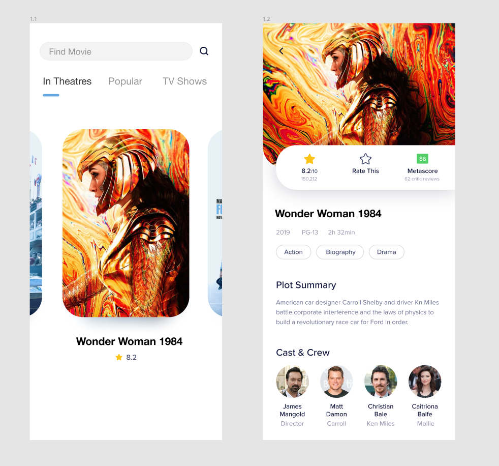

# Penggunaan function

  

## Objectives

Buatlah website seperti gambar di atas menggunakan ReactJs

  Buatlah halaman yang memiliki komposisi
- Statefful Component
- Fetch API
- Menggunakan props untuk mengirim data

## Directions
API
- https://api.themoviedb.org

Design
- https://www.figma.com/file/B8IszQOzwU08DYIKvzzILg/movie-app-(Copy)?type=design&node-id=0%3A1&mode=design&t=iGz0Uk27fHRHbwXS-1